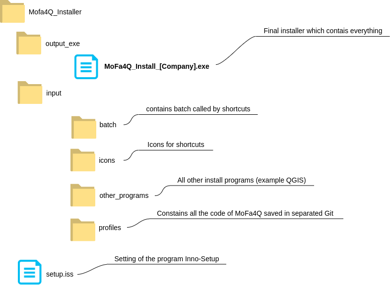

# QGIS-Install_MoFa4Q
MoFa4Q-Installer has its own Git-Repo (separate from the MoFa4Q Repo) 

MoFa4Q-Installer prepare an executable file, which installs automatically the profile of MoFa4Q on Windows-PC.

PLEASE NOTE: The installer only works on Windows (not Ubuntu, OSMac)!

This is the architecture:


The folder output_exe contains an executable file which contains everything necessary to install MoFa4Q.
This final .exe file is created by Inno Script Studio using various files located in the Input folder. The file is quite large because the final exe file contains the QGIS installer itself!

After installation by the user, the following resources are saved on the computer:
- QGIS application under **C:\Program Files\QGIS 3.xx.xx**
- MoFa4A Application, which contains useful resources (icons, batch files, etc.).
It will be stored:
  - C:\Users\[USERR_NAME]\AppData\Local\Programs\ if installed for the only current user
  - C:\Program Files\ if installed for all users
- The QGIS profile for MoFa4Q under standard location of profiles **"C:\Users\[USERR_NAME]\AppData\Roaming\QGIS\QGIS3\profiles\profiles\MoFa4Q_{#MyAppCompany}"**


## Quick start
The executable with a standard configuration is available under: https://github.com/WhereGroup/qgis_mofa4q_installer/releases/download/v2.1.0/MoFa4Q_v.2.1.0-qgis_ltr_3.34.4-windows-x64.exe

If you need some sample data to show in MoFa4Q you can try to use:
https://github.com/WhereGroup/qgis_mofa4q_installer/releases/download/v2.1.0/hh_sample_data.zip 

Data used for the presentation at FOSSGIS in Hamburg 

Quick start for creating the executable:
1. clone this repo locally (e.g. under C:\devel\mofa4q_public). 
The folder is named as [QGIS-Install_MoFa4Q]
2. go to the folder [QGIS-Install_MoFa4Q]\input\profiles\ 
3. download the repo of the QGIS profile https://github.com/WhereGroup/qgis_mofa4q_profile in this folder
4. Change the name of the repository folder from 'qgis_mofa4q_profile' to 'mofa4q_public'
5. download QGIS of your choose (at time of writing QGIS LTR Version 3.34.4) 
and save the installation file under [QGIS-Install_MoFa4Q]\input\other_programs 
6. download demo dop data dop.gpkg from https://files.wheregroup.com/s/SXEaPTfSTmKHjmT
and save it under [QGIS-Install_MoFa4Q]\input\profiles\geopackages\dop 
7. to create the installation file you need the program Inno Setup (the used version is innosetup-6.2.1).
Please install from here https://jrsoftware.org/isdl.php. 
8. start Inno Script Studio
9. go to the [QGIS-Install_MoFa4Q] folder 
10. open the file setup_mofa4q.iss in Inno Script Studio 
11. **adjust constants** on the file based on your need (see par. "Configuration setup_mofa4q.iss")

- folder of the installer = **DEVELDir** (devel) + **DEVEL_QGISInstallMofa4Q** (mofa4q_public)

  Example: C:\devel\mofa4q_public

- QGIS profile name: = **MyAppName** (MoFa4Q) and **MyAppCompany** (public) 

  Example: C:\devel\mofa4q_public\input\profiles\mofa4q_public

12. click on the button "Compile the current Inno Setup Script" in Inno Script Studio 
13. after a while an exe file is created under the folder [QGIS-Install_MoFa4Q]\output_exe 
14. distribute the exe file to the PC where you want to install MoFa4Q. Double-click the exe file to install QGIS and MoFa4Q.  
15. as an alternative to the exe file, you can use the silent installer (see "Silent installer").
16. To simulate the use of Synctool (see section Synctool), the last two lines of manifest.txt must be enabled:
```
qgisSyncDev=dev
qgisSyncDevServer=C:\geopackages
```
With this configuration, the synctool will look at the local C:\geopackages folder to retrieve new data, instead of looking at a real network server. 


### Configuration setup_mofa4q.iss
It is possible to customize MoFa4Q, e.g. to define where MoFa4Q should be installed. 
The setup is done in the file setup_mofa4q.iss, the configuration file used to generate the exe file. Attention: be careful when changing the configuration, otherwise the program will not work anymore.

Among the variables the ones worth mentioning are the following:
- **MyAppName** is the name of MoFa4Q application, this constant should be not changed, 
because it is used direct in the code (e.g. MoFa4Q.bat)

- **DEVELDir**  where this repo of the installer is saved

- **DEVEL_QGISInstallMofa4Q**  This is the name of the installer repo folder.

- **QGISVersion** and **QGISFileName**: define the QGIS version.  The QGIS's installer must be saved under: 

  C:\{#DEVELDir}\{#DEVEL_QGISInstallMofa4Q}\input\other_programs\


NB: **DefaultDirName** defines the folder where the program will be installed

    https://jrsoftware.org/ishelp/index.php?topic=setup_defaultdirname


Inno Setup creates under C:\devel\mofa4q_public\output_exe the exe file: 
MoFa4Q_public_Install.exe

Then, I can install on the computer the App MoFa4Q. Double click MoFa4Q_public_Install.exe

After the installation, we can have a look at what is being installed.

MoFa4Q program itself (not the profile) which contains batch files and icons is saved at following folder, if the installation is done only for the current user:
C:\Users\[USER_NAME]\AppData\Local\Programs\MoFa4Q

Otherwise, if the installation is done for all users, it will be saved here:
C:\Users\MoFa4Q

The profile is under the standard Windows location:
c:\Users\[USER_NAME]\AppData(Roaming)\QGIS\QGIS3\profiles

### License + Protocols (changelog.txt)  + manifest 
License and changelog.txt are saved in the profile at the main folder. 

But they are also copied by the installer in the folder: 
C:\Users\[USER_NAME]\AppData\Local\Programs\MoFa4Q

The installer used some its constants of the file setup_mofa4q.iss to generate the **manifest.txt**, which contains informations used by synctool and MoFa4Q

### Synctool
MoFa4Q used all offline data, even for the background map. A Synctool has been developed to refresh and update the data. When the PC is connected to a network it is possible to check if new data is available and download it. 


The Synctool is a standalone Python application (file batch/mofa4q_sync.py) which is also installed by the installer.

To simulate the use of Synctool the last two lines of manifest.txt must be enabled:
```
qgisSyncDev=dev
qgisSyncDevServer=C:\geopackages
```
With this configuration, the synctool will look at the local C:\geopackages folder to retrieve new data, instead of looking at a real network server.

### Silent installer
It is also possible to install MoFa4Q in silent mode (no windows are displayed during the installation).
In addition, SILENT_MoFa4Q_Install_logging.cmd logs information about the installation to a temp file.
